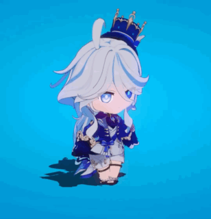

<!-- Banner -->

  

<!-- Logo / Avatar -->

  

<h1 align="center">👋 Hi, I'm M. Faiq Irsyad Ramadhan</h1>

💻 Aspiring Software Engineer | 🚀 Creative Developer | 🎮 Gamer

---

## ✨ About Me
- 🔭 Currently learning **Web Development** and **Game Development**  
- 🌱 Exploring **JavaScript, React, Node.js, and Python**  
- 🎮 Love building creative projects, coding, and gaming  
- 📫 Reach me on: [GitHub](https://github.com/hawoooh) | [LinkedIn](#)  

  

---

## 🛠️ Languages & Tools

  <!-- Programming Languages -->
  
  
  
  
  
  
  
  
  <!-- Tools -->
  
  
  

---

## 🏆 GitHub Stats

  
  

---

## 🎉 My ....... 😙

  
  
  

---

<!-- Footer Decoration -->

  

